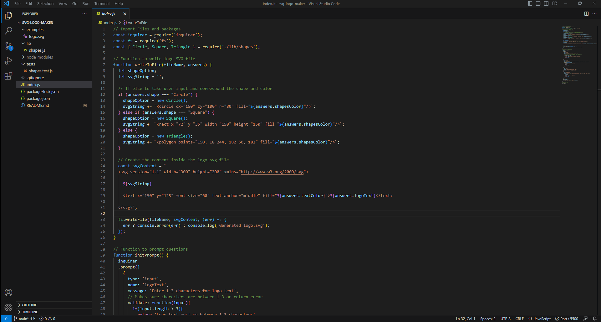
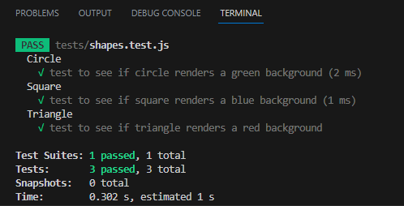

# svg-logo-maker

## Description

Generate a SVG logo from a variation of prompt questions. The user's SVG will be determined by the input they provide, you have an option of three shapes (Circle, Square, and Triangle). You then can type text between 1-3 characters for your logo and pick the color for both text and shape. You then will be provided with a new logo.svg file where you can view it.

## Table of Contents

* [Description](#description)
* [Installation](#installation)
* [Usage](#usage)
* [Walkthrough Video](#walkthrough-video)
* [Tests](#tests)

## Installation

Make sure you have NodeJS installed, to check type "node -v" in your terminal, if not visit [NodeJs website](https://nodejs.org/en/download). You then want to clone the repo onto your local machine. After that type "npm install" to install package.json and then type "npm i inquirer" and "npm i jest" to get the inquirer and jest packages.

## Usage

## Walkthrough Video

[Link](https://drive.google.com/file/d/1qplU6GiWBl36Q4POXohSKIiOA3ChNwSn/view)

## Tests

To run tests for this repo simply just type "npm test" into the terminal.

